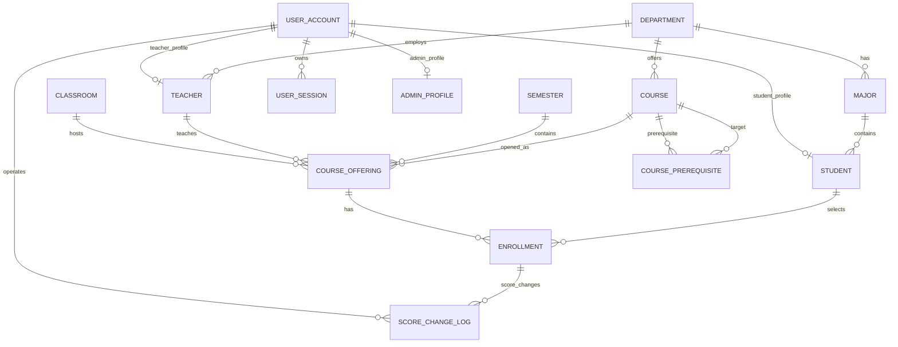

# 数据库原理2大作业期末报告初稿

题目：基于 openGauss 的学生选课成绩管理系统数据库设计与实现分析

项目类型：数据库应用系统设计  
数据库平台：openGauss  
应用技术：Python、Streamlit、psycopg2、Docker  
主要依据：`opengauss_setup/sql/init.sql`、`db/connection.py`、`services/*.py`、`pages/*.py`、`README.md`

## 摘要

本项目实现了一个面向高校教学管理场景的学生选课成绩管理系统。系统以 openGauss 数据库为核心，围绕学生、教师、管理员三类用户，完成课程查询、选课退课、课程与开课班次维护、成绩录入、成绩日志记录等功能。本文不是从普通软件功能角度介绍系统，而是按照数据库系统设计流程，对项目的规划、需求分析、概念结构设计、逻辑结构设计、规范化分析、完整性约束、触发器、事务与并发控制、物理设计以及运行维护进行系统分析。

系统当前数据库模式集中定义在 `opengauss_setup/sql/init.sql` 中，共包含 14 张主要表：`department`、`major`、`user_account`、`user_session`、`student`、`teacher`、`admin_profile`、`semester`、`course`、`classroom`、`course_offering`、`course_schedule`、`course_prerequisite`、`enrollment` 和 `score_change_log`。其中，`course` 与 `course_offering` 的分离、`course_schedule` 对上课时间片的结构化表达、`enrollment` 对学生与开课班次多对多关系的转换、`course_prerequisite` 对课程先修自关联的表达，是本系统数据库设计的核心。系统已实现较完整的主键、外键、唯一约束、CHECK 约束、默认值和常用索引；选课流程已通过 `DBSession` 和 `SELECT ... FOR UPDATE` 将容量检查、时间冲突检查、先修检查和写入放入同一事务。仍可继续完善的是数据库级触发器规则、数据库用户权限和更完整的运行维护体系。

> 2026-06-08 设计更新说明：项目已按 3NF 方向完成一次结构重构，删除 `course_offering.selected_count`、`course_offering.schedule_text` 和 `enrollment.gpa_point` 三个反范式风险字段；页面需要展示的已选人数、上课时间文本和绩点改为查询时计算。选课服务也已补充事务和行级锁，用于降低并发抢课导致超选的风险。详细变更见 `docs/THIRD_NORMAL_FORM_REFACTOR.md`。

关键词：数据库设计；ER 模型；关系模型；范式；完整性约束；触发器；事务；锁；openGauss；选课系统

## 第1章 绪论与系统规划

### 1.1 本章目标

本章从数据库系统设计流程的规划阶段出发，说明本项目建设的背景、目标、数据库应用系统边界以及技术选型。规划阶段的重点不是具体表结构，而是说明为什么需要建立数据库系统、系统需要管理哪些信息，以及数据库在整个应用中的核心地位。

### 1.2 课程知识点对应

本章对应数据库设计流程中的规划阶段。课堂笔记中提到，数据库系统设计通常包括规划、需求分析、概念设计、逻辑设计、物理设计、实现与运行维护等阶段。规划阶段需要确定数据库系统的必要性和可行性，明确系统信息范围、信息来源、软硬件资源和系统目标。对于数据库应用系统而言，数据库不是普通的存储文件，而是组织、约束、维护和访问数据的核心。

### 1.3 项目中的具体体现

本项目是一个学生选课成绩管理系统，面向高校课程管理场景。系统需要保存和处理的数据包括组织结构、用户身份、课程资源、开课安排、选课记录和成绩审计记录。项目当前采用 Python + Streamlit 实现应用界面，使用 psycopg2 连接 openGauss 数据库，并通过 Docker 在本地运行数据库服务。

项目中与规划阶段相关的证据主要包括：

- `README.md` 说明系统支持学生、教师、管理员三类角色，以及各角色的功能范围。
- `config.py` 中定义 openGauss 连接参数，包括主机、端口、用户和数据库名。
- `requirements.txt` 中列出了 `streamlit`、`psycopg2-binary`、`pandas`、`cryptography` 等依赖。
- `opengauss_setup/docker/docker-compose.yml` 和 `opengauss_setup/docker/init_db.sh` 用于启动和初始化本地 openGauss 数据库。
- `opengauss_setup/sql/init.sql` 是当前系统数据库结构的主要定义文件。

从系统规划角度看，本项目的数据库承担以下核心职责：

1. 保存教学管理的基础数据，例如院系、专业、教师、学生、课程和教室。
2. 保存教学过程数据，例如学期、开课班次、选课记录和成绩。
3. 通过完整性约束保证数据的正确性和相容性。
4. 通过触发器维护派生数据，例如开课班次的已选人数。
5. 通过事务和锁机制的设计保障选课等并发场景下的一致性。

### 1.4 设计合理性分析

从数据库应用系统的角度看，选课系统具有明显的数据中心特征。学生选课、教师录入成绩、管理员维护课程，本质上都是对数据库中实体和联系的增删改查。如果仅从前端页面或普通程序功能出发，很容易忽略容量约束、重复选课、成绩范围、先修关系和并发抢课等数据库问题。本项目以关系数据库作为核心，能够较好地支撑这些规则。

技术选型上，openGauss 属于关系型数据库，适合表达学生、课程、教师、选课记录等结构化数据。psycopg2 直接执行 SQL，使项目中的数据库结构和查询语句比较清晰，也便于在课程报告中直接分析关系模型、完整性约束和事务设计。Docker 部署降低了环境配置难度，使数据库初始化和迁移过程更可重复。

### 1.5 不足与改进

当前规划层面仍存在以下不足：

1. 项目主要使用单一数据库账号连接 openGauss，数据库级用户权限和角色尚未细分。
2. 初始化脚本可以重建数据库，但备份恢复、日志归档和运行监控方案还不完整。
3. 当前部署属于本地集中式数据库应用，尚未设计多节点、分布式或高可用方案。

改进方向包括：为应用、管理员和只读统计分别设计数据库账号；增加定期备份脚本；明确数据库初始化、升级、备份、恢复和权限管理流程；在后续扩展中考虑分布式部署或读写分离，但本次课程报告仍以集中式关系数据库设计为主。

## 第2章 需求分析

### 2.1 本章目标

本章从需求分析阶段出发，整理系统用户、核心业务功能、数据需求和业务规则。数据库需求分析的目标是明确系统需要保存哪些数据、处理哪些业务，以及这些业务对数据完整性和一致性的要求。

### 2.2 课程知识点对应

需求分析阶段需要确定用户的数据需求和处理需求，并形成数据字典、数据流和处理过程说明。对于选课系统来说，需求分析不能停留在“有哪些页面”，而应进一步分析数据对象、数据之间的联系以及业务规则。例如，学生选课不仅是点击按钮，还涉及选课记录、课程容量、学期状态、先修课程、时间窗口和重复选课约束。

### 2.3 项目中的具体体现

系统当前包含三类用户角色。

学生角色：

- 登录系统。
- 查看当前学期可选课程。
- 选择开课班次。
- 查看已选课程并在规则允许时退课。
- 查看已修课程成绩单、学分、平均分和绩点。

教师角色：

- 登录系统。
- 查看自己负责的开课班次。
- 批量录入或修改学生成绩。
- 查看成绩分布和成绩修改日志。

管理员角色：

- 查看系统概览。
- 管理学期、课程、开课班次。
- 管理学生和教师基础信息。
- 维护成绩。
- 查看课程容量和各类统计信息。

这些角色在 `app.py` 的 `_NAV` 中被明确区分，页面权限由 `pages/_guards.py` 中的 `require_role()` 控制。业务逻辑主要位于 `services` 目录中，例如 `selection_service.py` 处理选课退课，`score_service.py` 处理成绩维护，`course_service.py` 处理课程、学期和开课班次管理。

### 2.4 数据需求分析

系统需要管理的数据可以分为五类。

第一类是组织结构数据，包括 `department`、`major` 和 `classroom`。院系和专业用于组织学生、教师和课程，教室用于约束开课班次的教学资源。

第二类是用户身份数据，包括 `user_account`、`user_session`、`student`、`teacher` 和 `admin_profile`。其中 `user_account` 是统一账号表，保存用户名、密码哈希、角色和账号状态；学生、教师、管理员表保存各自的详细资料。

第三类是教学安排数据，包括 `semester`、`course`、`course_offering`、`course_schedule` 和 `course_prerequisite`。其中 `course` 表示课程定义，`course_offering` 表示某学期某教师开设的具体教学班，`course_schedule` 表示教学班的结构化上课时间片，`course_prerequisite` 表示课程之间的先修关系。

第四类是选课成绩数据，主要是 `enrollment`。该表既是学生与开课班次之间多对多联系的中间表，也保存选课时间、选课状态、最终成绩和备注。绩点由成绩在查询时动态计算，不再作为基础字段保存。

第五类是审计数据，主要是 `score_change_log`，用于记录成绩修改前后的值、操作人、时间和原因。

### 2.5 业务规则分析

当前项目已经实现的主要业务规则包括：

1. 学生不能重复选择同一个开课班次。数据库层通过 `enrollment` 表上的 `UNIQUE(student_id, offering_id)` 保证，应用层在 `selection_service.enroll()` 中也会先查询已有记录。
2. 课程容量限制。`selection_service.enroll()` 在同一事务中锁定目标 `course_offering` 行，聚合计算 `enrollment` 中当前 `selected` 记录数，并与 `max_capacity` 比较，已满则拒绝选课。
3. 学期状态限制。只有 `semester.status = 'open'` 时才允许选课和退课。
4. 开课班次状态限制。只有 `course_offering.status = 'open'` 时允许选课。
5. 选课时间窗口限制。应用层使用 `CURRENT_TIMESTAMP BETWEEN selection_start AND selection_end` 判断是否在开放时间内。
6. 先修课限制。`selection_service._has_passed_prerequisites()` 查询 `course_prerequisite` 和历史已完成课程，要求先修课程成绩达到 60 分及以上。
7. 退课限制。`selection_service.drop()` 要求只能退自己的课，记录状态必须为 `selected`，已录入成绩的课程不能退课。
8. 成绩录入权限。`score_service.can_manage_offering_score()` 限制教师只能维护自己负责的开课班次，管理员可以维护所有班次。
9. 成绩范围限制。数据库 CHECK 和应用层都限制成绩在 0 到 100 之间。
10. 时间冲突检查。系统通过 `course_schedule` 中的星期和节次区间判断目标班次与学生已选班次是否重叠，冲突时拒绝选课。
11. 成绩修改日志。`score_service.update_score()` 在更新成绩后向 `score_change_log` 写入日志。

当前尚未完全实现、适合作为设计目标或改进方向的规则包括：

1. 同一学期同一课程跨班重复选择限制。当前唯一约束只能防止重复选择同一个 `offering_id`，不能防止选择同一课程的不同教学班。
2. 数据库层触发器强约束。当前容量、时间冲突等复杂规则主要在服务层事务中实现，后续可以继续设计数据库触发器作为补强。
3. 教室容量约束。当前没有强制 `course_offering.max_capacity <= classroom.capacity`。
4. 成绩更新和日志写入的事务原子性。当前两步由两次 `execute()` 完成，不是严格同一事务。

### 2.6 设计合理性分析

需求分析体现了选课系统的典型业务特征：数据对象多、联系复杂、约束条件多。系统将核心规则分布在数据库层和应用层：稳定、通用、可由 SQL 表达的规则使用主键、外键、唯一约束和 CHECK 约束；涉及当前时间、先修课查询、用户身份、页面权限的规则主要放在服务层。这样的分工符合数据库应用系统的实际开发方式。

例如，重复选择同一教学班可以直接用唯一约束表达，因此放在数据库层最可靠；而先修课是否通过需要连接当前开课班次、课程先修关系和历史成绩，当前实现放在应用层查询中，较易理解和维护。

### 2.7 不足与改进

需求分析层面最主要的改进已经体现在本次重构中：时间冲突检查所需的上课时间已拆为 `course_schedule`，容量控制已放入带行级锁的事务流程。后续仍可继续增强同课跨班限制、教室容量限制和数据库级触发器，把更多业务规则从“服务层约定”提升为“数据库可验证的完整性设计”。

## 第3章 概念结构设计

### 3.1 本章目标

本章使用 ER 模型分析系统的概念结构，识别实体、属性和联系，并说明各实体之间的基数关系。概念设计的目标是独立于具体 DBMS，从现实业务出发建立清晰的数据模型。

### 3.2 课程知识点对应

概念设计阶段要求抽象现实世界中的对象及其联系。ER 模型中的实体、属性、联系和基数是本章的核心知识点。课堂中提到，概念模型应充分反映现实世界的信息联系，同时保持简洁、清晰、易于向关系模型转换。

### 3.3 项目中的具体体现

当前系统可以抽取出以下主要实体：

- 院系 `department`：属性包括 `dept_id`、`dept_name`、`office_phone`、`office_location`。
- 专业 `major`：属性包括 `major_id`、`major_name`、`dept_id`。
- 用户账号 `user_account`：属性包括 `user_id`、`username`、`password_hash`、`role`、`status`、`last_login_at`、`created_at`。
- 登录会话 `user_session`：属性包括 `session_id`、`user_id`、`token_hash`、`created_at`、`expires_at`、`revoked_at`、`last_seen_at`。
- 学生 `student`：属性包括 `student_id`、`user_id`、`student_name`、`gender`、`birth_date`、`enroll_year`、`major_id`、`class_name`、`phone`、`email`、`status`。
- 教师 `teacher`：属性包括 `teacher_id`、`user_id`、`teacher_name`、`gender`、`dept_id`、`title`、`phone`、`email`、`status`。
- 管理员 `admin_profile`：属性包括 `admin_id`、`user_id`、`admin_name`、`phone`。
- 学期 `semester`：属性包括 `semester_id`、`semester_name`、`start_date`、`end_date`、`selection_start`、`selection_end`、`status`。
- 课程 `course`：属性包括 `course_id`、`course_name`、`course_type`、`credit`、`total_hours`、`dept_id`、`description`、`status`。
- 教室 `classroom`：属性包括 `classroom_id`、`building`、`room_no`、`capacity`。
- 开课班次 `course_offering`：属性包括 `offering_id`、`course_id`、`semester_id`、`teacher_id`、`classroom_id`、`max_capacity`、`status`。
- 上课时间片 `course_schedule`：属性包括 `schedule_id`、`offering_id`、`weekday`、`start_section`、`end_section`。
- 选课记录 `enrollment`：属性包括 `enrollment_id`、`student_id`、`offering_id`、`select_time`、`status`、`final_score`、`remark`。
- 先修关系 `course_prerequisite`：属性包括 `course_id`、`prereq_course_id`。
- 成绩修改日志 `score_change_log`：属性包括 `log_id`、`enrollment_id`、`old_score`、`new_score`、`changed_by_user_id`、`changed_at`、`reason`。

主要联系和基数如下：

- 院系与专业：1:N。
- 专业与学生：1:N。
- 院系与教师：1:N。
- 院系与课程：1:N。
- 用户账号与学生、教师、管理员资料：1:1。
- 用户账号与登录会话：1:N。
- 课程与开课班次：1:N。
- 学期与开课班次：1:N。
- 教师与开课班次：1:N。
- 教室与开课班次：1:N。
- 学生与开课班次：M:N，通过 `enrollment` 转换。
- 课程与课程：M:N 自关联，通过 `course_prerequisite` 表示先修关系。
- 选课记录与成绩修改日志：1:N。
- 用户账号与成绩修改日志：1:N。

### 3.4 ER 图草案

以下 Mermaid ER 图可作为报告初稿中的概念结构图，后续可以根据排版需要转换为正式图片。



### 3.5 设计合理性分析

概念设计中最重要的合理性体现在“课程”和“开课班次”的分离。如果只设置课程表而不设置开课班次，则同一课程在不同学期、不同教师、不同教室开设时会混在一起，无法准确表达容量、上课时间和选课名单。当前设计将 `course` 作为课程定义，将 `course_offering` 作为具体教学班，符合高校选课业务的现实语义。

`enrollment` 的设计也符合 ER 模型转换原则。学生和开课班次之间是多对多联系，一个学生可以选多个班次，一个班次可以被多个学生选择。由于该联系本身具有属性，例如选课时间、状态和成绩，因此将其设计成独立关系是合理的。绩点不作为基础属性保存，而是由成绩查询时计算。

`course_schedule` 的引入使“一个教学班具有多个上课时间片”这一联系得到结构化表达。它既可以看作 `course_offering` 的弱实体，也可以看作开课班次与时间片之间的 1:N 联系转换结果。

课程先修关系使用 `course_prerequisite` 表表达课程自身的多对多联系，也符合自关联关系的建模方式。该表的复合主键可以避免重复定义同一先修关系。

### 3.6 不足与改进

当前概念模型中仍有几个可改进点：

1. 行政班级没有独立建模，`student.class_name` 只是文本字段。如果后续需要管理班级属性，应增加 `class` 表。
2. 课程先修关系没有防止环路，例如 A 先修 B、B 又先修 A。该问题需要递归查询或触发器辅助检查。
3. 成绩规则没有独立建模，绩点由查询逻辑根据 `final_score` 计算。若绩点规则可能变化，可增加绩点规则表。

## 第4章 逻辑结构设计

### 4.1 本章目标

本章将概念模型转换为关系模型，分析各表的关系模式、主键、外键、候选键和参照完整性。逻辑设计阶段的目标是把 ER 图转换为 DBMS 可以处理的关系结构。

### 4.2 课程知识点对应

逻辑设计阶段对应 ER 模型向关系模型的转换。实体通常转换为关系表，1:N 联系通过外键实现，M:N 联系转换为新的关系表，1:1 联系可以通过唯一外键实现。关系模型还需要明确主键、候选键、外键和完整性规则。

### 4.3 项目中的具体体现

当前主要关系模式如下。

组织结构：

- `Department(dept_id, dept_name, office_phone, office_location)`，主键为 `dept_id`。
- `Major(major_id, major_name, dept_id)`，主键为 `major_id`，外键 `dept_id` 引用 `department`。
- `Classroom(classroom_id, building, room_no, capacity)`，主键为 `classroom_id`。

用户与身份：

- `UserAccount(user_id, username, password_hash, role, status, last_login_at, created_at)`，主键为 `user_id`，`username` 唯一。
- `UserSession(session_id, user_id, token_hash, created_at, expires_at, revoked_at, last_seen_at)`，主键为 `session_id`，`token_hash` 唯一，`user_id` 引用 `user_account`。
- `Student(student_id, user_id, student_name, gender, birth_date, enroll_year, major_id, class_name, phone, email, status)`，主键为 `student_id`，`user_id` 唯一并引用 `user_account`，`major_id` 引用 `major`。
- `Teacher(teacher_id, user_id, teacher_name, gender, dept_id, title, phone, email, status)`，主键为 `teacher_id`，`user_id` 唯一并引用 `user_account`，`dept_id` 引用 `department`。
- `AdminProfile(admin_id, user_id, admin_name, phone)`，主键为 `admin_id`，`user_id` 唯一并引用 `user_account`。

教学安排：

- `Semester(semester_id, semester_name, start_date, end_date, selection_start, selection_end, status)`，主键为 `semester_id`。
- `Course(course_id, course_name, course_type, credit, total_hours, dept_id, description, status)`，主键为 `course_id`，`dept_id` 引用 `department`。
- `CourseOffering(offering_id, course_id, semester_id, teacher_id, classroom_id, max_capacity, status)`，主键为 `offering_id`，外键分别引用 `course`、`semester`、`teacher` 和 `classroom`。
- `CourseSchedule(schedule_id, offering_id, weekday, start_section, end_section)`，主键为 `schedule_id`，`offering_id` 引用 `course_offering`，唯一约束为 `(offering_id, weekday, start_section, end_section)`。
- `CoursePrerequisite(course_id, prereq_course_id)`，复合主键为 `(course_id, prereq_course_id)`，两列都引用 `course`。

选课与成绩：

- `Enrollment(enrollment_id, student_id, offering_id, select_time, status, final_score, remark)`，主键为 `enrollment_id`，唯一约束为 `(student_id, offering_id)`，外键分别引用 `student` 和 `course_offering`。
- `ScoreChangeLog(log_id, enrollment_id, old_score, new_score, changed_by_user_id, changed_at, reason)`，主键为 `log_id`，外键分别引用 `enrollment` 和 `user_account`。

### 4.4 参照完整性分析

当前表结构通过外键维护主要参照完整性。例如，`course_offering.course_id` 引用 `course.course_id`，保证开课班次必须对应已有课程；`enrollment.offering_id` 引用 `course_offering.offering_id`，保证选课记录必须对应已有教学班；`score_change_log.enrollment_id` 引用 `enrollment.enrollment_id`，保证成绩日志必须对应已有选课记录。

多数外键没有设置级联删除，这意味着如果某个实体已被其他表引用，数据库会阻止直接删除。这种策略适合教学管理系统，因为学生选课记录和成绩具有历史价值，不应被随意级联删除。

### 4.5 设计合理性分析

当前逻辑结构的一个重要优点是把稳定数据和过程数据分开。`course`、`student`、`teacher` 属于基础实体，`course_offering` 属于教学安排，`enrollment` 属于过程数据，`score_change_log` 属于审计数据。这种分层能够减少冗余，提高关系模型的清晰度。

另一个优点是统一账号设计。`user_account` 负责登录和角色，学生、教师、管理员表负责各自业务资料。这样避免在多个角色表中重复保存账号字段，同时可以通过 `role` 字段进行统一权限判断。

### 4.6 不足与改进

当前逻辑设计的不足主要包括：

1. `enrollment` 只限制 `(student_id, offering_id)` 唯一，不能直接限制同一学生同一学期选择同一课程的多个班次。
2. `classroom` 未对 `(building, room_no)` 设置唯一约束，现实中这通常也是一个候选键。
3. `student.class_name` 暂未拆出行政班实体，这是本次重构中有意保留的后续改进点。
4. 部分删除策略依赖外键报错，应用层可进一步提前检测并给出更清晰的提示。

## 第5章 规范化设计与范式分析

### 5.1 本章目标

本章是报告重点章节，基于关系模式分析系统是否满足 1NF、2NF、3NF 和 BCNF，并讨论当前设计中已符合规范化的地方、可能违反范式的地方以及出于性能或实现简化考虑的反规范化设计。

### 5.2 课程知识点对应

规范化理论是数据库设计的重要工具。1NF 要求属性取值原子化；2NF 要求非主属性完全函数依赖于候选键，消除部分依赖；3NF 要求消除非主属性对候选键的传递依赖；BCNF 要求每个非平凡函数依赖的决定因素都是候选键。规范化的目标是减少数据冗余，避免插入异常、删除异常和更新异常。

### 5.3 项目中的具体体现：总体规范化评价

当前系统总体上采用了较合理的规范化设计。课程基础信息没有存放在选课记录中，而是单独存放在 `course` 表；具体学期、教师、教室和容量信息单独存放在 `course_offering` 表；学生与教学班之间的联系及成绩信息存放在 `enrollment` 表。这种设计避免了课程名称、学分、学时等信息在每一条选课记录中重复出现。

用户账号与学生、教师、管理员资料的分离也体现了规范化思想。登录信息保存在 `user_account`，角色资料保存在对应资料表中。这样既减少了重复字段，也使统一登录和角色控制更加清晰。

### 5.4 第一范式分析

1NF 要求关系中的每个属性都是不可再分的原子值。当前多数表基本满足 1NF，例如 `department.dept_name`、`student.student_name`、`course.credit`、`enrollment.final_score` 等字段都是单值属性。

重构前，`course_offering.schedule_text` 曾存在严格 1NF 风险。该字段保存类似“周一 1-2 节 / 周三 3-4 节”的文本，实际上包含多个上课时间片。若将“星期”“开始节次”“结束节次”视为独立数据项，则一个字段保存多个数据项不利于 1NF，也不便于时间冲突检查。

本次重构已经新增结构化时间表：

```sql
CourseSchedule(schedule_id, offering_id, weekday, start_section, end_section)
```

其中 `offering_id` 引用 `course_offering`，`weekday` 表示星期，`start_section` 和 `end_section` 表示节次。这样一个教学班的多个上课时间可以由多条记录表示，既满足 1NF，也支持时间冲突检查。

### 5.5 第二范式分析

2NF 主要针对存在复合候选键的关系。当前大部分表使用单属性主键，如 `student_id`、`course_id`、`offering_id`、`enrollment_id`，因此不存在典型的部分依赖问题。

需要重点分析的是 `course_prerequisite` 和 `enrollment`。

`course_prerequisite(course_id, prereq_course_id)` 的主键是复合键，但该表没有非主属性，因此不存在非主属性只依赖 `course_id` 或只依赖 `prereq_course_id` 的情况，满足 2NF。

`enrollment` 虽然主键是 `enrollment_id`，但还存在候选键 `(student_id, offering_id)`。其非主属性如 `select_time`、`status`、`final_score` 和 `remark` 都描述“某学生选择某教学班”这一完整事实，而不是只依赖学生或只依赖教学班。例如成绩不是学生本人的固定属性，也不是教学班的固定属性，而是学生在某教学班中的学习结果。因此从业务语义看，`enrollment` 满足 2NF。

### 5.6 第三范式分析

3NF 要求非主属性不应通过其他非主属性间接依赖候选键。当前大部分核心表达到 3NF。例如：

- `student` 表只保存 `major_id`，不冗余保存 `major_name` 或 `dept_name`，避免 `student_id -> major_id -> dept_id/dept_name` 这类传递依赖。
- `course` 表只保存 `dept_id`，不冗余保存院系名称。
- `course_offering` 表只保存 `course_id`、`teacher_id`、`semester_id` 和 `classroom_id`，不重复保存课程名、教师名、学期名或教室容量。
- `score_change_log` 保存成绩变更事件，不把学生姓名、课程名等可由外键连接得到的信息冗余到日志表。

本次重构重点处理了两个 3NF 风险。

第一，`enrollment.gpa_point` 可由 `final_score` 和绩点换算规则计算得到。若把绩点直接存入 `enrollment`，则可能存在 `final_score -> gpa_point`，而 `final_score` 不是候选键，会形成 3NF 风险。当前设计已删除 `gpa_point` 字段，成绩单和页面展示通过 SQL CASE 表达式动态计算绩点，从而消除了该派生字段。

第二，`course_offering.selected_count` 可由 `enrollment` 中 `status='selected'` 的记录数聚合得到。若把该值保存在 `course_offering` 中，则会形成跨表派生冗余，并要求触发器或事务持续维护一致性。当前设计已删除 `selected_count` 字段，课程列表和管理员首页通过聚合查询得到已选人数。

剩余需要说明的是 `student.class_name`。当前它只是展示用文本字段。如果业务中行政班本身有独立属性，例如专业、入学年份、辅导员、班主任等，则可能存在 `class_name -> major_id/enroll_year/...` 的传递依赖。当前系统没有班级管理需求，因此暂时保留文本字段；若扩展为完整教务系统，应拆出行政班表。

### 5.7 BCNF 分析

BCNF 要求每个非平凡函数依赖的决定因素都是候选键。当前部分表可以较明确地认为满足 BCNF，例如：

- `user_account` 中 `user_id` 和 `username` 都是候选键，决定因素均为候选键。
- `user_session` 中 `session_id` 和 `token_hash` 都是候选键。
- `course_prerequisite` 只有复合主键和主属性，基本满足 BCNF。

但对所有表都直接断言满足 BCNF 并不严谨，需要结合业务语义判断。例如：

- `classroom` 中现实上可能有 `(building, room_no) -> classroom_id, capacity`，但当前只设置 `classroom_id` 为主键，没有设置 `UNIQUE(building, room_no)`。如果承认楼栋和房间号能唯一确定教室，则应把 `(building, room_no)` 也作为候选键，否则 BCNF 需要补强。
- `course_offering` 与 `course_schedule` 组合后，如果业务规定同一课程、同一学期、同一教师、同一组时间片只能开一个班，则需要额外设计候选键或触发器检查。当前尚未把该复杂业务规则固化为唯一约束。
- `enrollment` 当前不再保存 `gpa_point`，因此不再存在 `final_score -> gpa_point` 造成的 BCNF 风险。但如果未来引入绩点规则版本，则需要重新分析成绩、规则版本和绩点之间的函数依赖。

因此，本项目可在报告中如实表述为：核心实体表当前总体达到 3NF，部分表在业务语义明确后可进一步补充候选键约束以强化 BCNF；不能为了显得高级而直接断言所有表都满足 BCNF。

### 5.8 反规范化设计分析

重构前系统存在两个典型反规范化字段：`course_offering.selected_count` 和 `enrollment.gpa_point`。它们分别来自选课记录聚合和成绩换算规则。当前系统已经删除这两个字段，改为查询时计算。

这种设计降低了更新异常风险。例如，退课、恢复选课、成绩修改时不需要同步维护额外派生字段。代价是课程列表和成绩单查询需要执行聚合或 CASE 计算，因此物理设计中补充了 `idx_enrollment_student_status`、`idx_enrollment_offering_status` 等索引，以减轻查询成本。

### 5.9 设计合理性分析

本项目规范化设计的主要优点是层次清晰，减少了重复信息。例如，选课记录只保存 `student_id` 和 `offering_id`，不直接保存学生姓名、课程名称、教师姓名和学分。这些信息在需要展示时通过 JOIN 查询得到。这符合关系数据库通过外键连接表达数据联系的思想。

同时，系统没有为了追求“绝对拆分”而立即拆出行政班和绩点规则表。`student.class_name` 当前只是展示标签，绩点规则当前固定在查询逻辑中。这样的取舍使本次重构聚焦于选课系统最核心的数据依赖。

### 5.10 不足与改进

规范化方面的改进重点包括：

1. 对 `classroom(building, room_no)` 增加唯一约束。
2. 根据业务需要拆分 `student.class_name` 为行政班实体。
3. 如果绩点规则未来可能变化，可新增绩点规则表并保存规则版本。
4. 若要限制同一学生同一学期选择同一课程的多个班次，可增加触发器或更复杂的唯一性设计。

## 第6章 数据库完整性约束与触发器设计

### 6.1 本章目标

本章分析系统中已经实现的完整性约束、触发器和应用层检查机制，并结合选课业务讨论尚未实现但应当补充的数据库规则。

### 6.2 课程知识点对应

本章对应数据库完整性和触发器知识。数据库完整性包括实体完整性、参照完整性和用户定义完整性。SQL 中常用主键、外键、NOT NULL、UNIQUE、CHECK、DEFAULT 等约束表达完整性规则。触发器属于主动规则，通常由事件、条件和动作组成，可以在插入、删除或更新时自动执行数据库操作。

### 6.3 项目中的具体体现：数据库层约束实现

当前 `opengauss_setup/sql/init.sql` 中为各核心表设置了主键，保证实体完整性。例如，`student.student_id` 唯一标识学生，`course.course_id` 唯一标识课程，`course_offering.offering_id` 唯一标识具体教学班，`enrollment.enrollment_id` 唯一标识选课记录。

外键约束用于保证参照完整性。例如：

- `major.dept_id` 引用 `department.dept_id`。
- `student.user_id` 引用 `user_account.user_id`。
- `student.major_id` 引用 `major.major_id`。
- `teacher.dept_id` 引用 `department.dept_id`。
- `course.dept_id` 引用 `department.dept_id`。
- `course_offering.course_id` 引用 `course.course_id`。
- `course_offering.semester_id` 引用 `semester.semester_id`。
- `course_offering.teacher_id` 引用 `teacher.teacher_id`。
- `course_offering.classroom_id` 引用 `classroom.classroom_id`。
- `enrollment.student_id` 引用 `student.student_id`。
- `enrollment.offering_id` 引用 `course_offering.offering_id`。
- `score_change_log.enrollment_id` 引用 `enrollment.enrollment_id`。

唯一约束用于表达候选键和业务唯一性。例如，`user_account.username` 唯一，`user_session.token_hash` 唯一，`student.user_id`、`teacher.user_id`、`admin_profile.user_id` 均唯一，保证一个账号不会对应多个同类资料。`enrollment` 上的 `UNIQUE(student_id, offering_id)` 是选课系统中非常重要的业务约束，可以防止同一学生重复选择同一教学班。

CHECK 约束用于表达属性取值范围。例如：

- `user_account.role` 限制为 `admin`、`student`、`teacher`。
- `student.status` 限制为 `enrolled`、`suspended`、`graduated`、`dropped`。
- `teacher.status` 限制为 `active`、`retired`、`leave`。
- `semester.status` 限制为 `planned`、`open`、`closed`。
- `course.credit > 0`，`course.total_hours > 0`。
- `classroom.capacity > 0`。
- `course_offering.max_capacity > 0`。
- `course_schedule.weekday BETWEEN 1 AND 7`，并要求 `end_section >= start_section`。
- `enrollment.final_score` 必须在 0 到 100 之间。

### 6.4 已实现触发器分析

当前 3NF 版本没有使用触发器维护 `course_offering.selected_count`，因为该字段已经从基础表中删除，已选人数改为根据 `enrollment` 聚合计算。这一调整减少了派生数据同步问题，也避免了触发器维护不完整导致的数据不一致。

从数据库课程角度看，触发器仍然是本系统可继续完善的重要方向。对于选课系统，可以设计 `BEFORE INSERT OR UPDATE ON enrollment` 触发器，在数据库层统一检查容量、时间冲突和退课限制。例如：

- 事件：向 `enrollment` 插入选课记录，或将状态从 `dropped` 恢复为 `selected`。
- 条件：目标班次未关闭、当前已选人数小于容量上限、学生已选时间片不冲突。
- 动作：允许写入；否则抛出异常拒绝操作。

该方案体现了触发器的 ECA 模型：

- Event：`INSERT` 或 `UPDATE`。
- Condition：容量、时间冲突、状态、成绩等业务条件。
- Action：允许、拒绝或记录审计日志。

当前项目选择先在服务层事务中实现这些复杂检查，是为了保持代码清晰；报告中可以把触发器作为进一步将业务规则下沉到数据库层的设计完善点。

### 6.5 应用层检查机制

除了数据库约束，系统还在服务层实现了大量业务检查。

在 `services/selection_service.py` 中，`enroll()` 会检查是否已有选课记录、学期是否开放、开课班次是否开放、当前时间是否在选课窗口内、容量是否已满、先修课程是否通过以及是否存在上课时间冲突。该函数当前使用 `DBSession` 把检查和写入放入同一事务，并用 `SELECT ... FOR UPDATE` 锁定目标 `course_offering` 行。`drop()` 会检查选课记录是否存在、是否属于当前学生、状态是否为 `selected`、是否已录入成绩、学期和时间窗口是否允许退课。

在 `services/score_service.py` 中，`update_score()` 会检查教师或管理员权限、选课记录状态、成绩是否为空、成绩是否在 0 到 100 之间，并在更新成绩后写入 `score_change_log`。

在 `services/course_service.py` 中，删除课程前会检查是否已有开课安排，删除开课班次前会检查是否已有选课或成绩记录。`services/teacher_service.py` 中删除教师前会检查是否存在开课记录。

### 6.6 尚未实现的检查机制与设计方案

当前系统已经在服务层实现时间冲突检查，并通过事务和行级锁降低并发超选风险。但这些规则仍主要依赖应用层代码。如果希望进一步体现数据库主动规则，可以在数据库层增加 BEFORE 触发器，对容量和时间冲突进行二次检查。

当前系统没有限制同一学生在同一学期选择同一课程的不同教学班。由于 `course_id` 和 `semester_id` 存在于 `course_offering` 表中，普通唯一约束无法跨表表达该规则。可以通过触发器检查，也可以在 `enrollment` 中冗余 `course_id`、`semester_id` 后设置 `UNIQUE(student_id, semester_id, course_id)`，但这会引入冗余字段，需要额外维护一致性。

当前系统没有强制 `course_offering.max_capacity <= classroom.capacity`。由于 CHECK 约束不能直接查询另一张表，该规则应通过触发器或应用层事务检查实现。

### 6.7 设计合理性分析

当前系统已经较好地结合了数据库层和应用层完整性。主键、外键、唯一约束和 CHECK 约束适合表达稳定且局部的规则；选课窗口、先修课、角色权限、时间冲突和容量检查等涉及多表查询或用户上下文的规则则放在服务层事务中。触发器目前作为设计完善点保留，可在后续用于数据库级强校验和审计。

### 6.8 不足与改进

不足主要在于：同课跨班重复、教室容量、成绩日志事务等关键规则还没有完全提升到数据库层或事务层。后续应优先补充数据库触发器、成绩日志事务化设计和更细粒度的权限控制。

## 第7章 事务管理、锁机制与并发控制

### 7.1 本章目标

本章分析当前项目中的事务实现和并发风险，重点围绕选课系统中的抢课场景，说明如何利用事务、锁和隔离性防止超选、重复选课和数据不一致。

### 7.2 课程知识点对应

本章对应事务和并发控制知识。事务具有 ACID 特性：原子性、一致性、隔离性和持久性。并发操作可能导致丢失更新、读脏数据、不可重复读、幻读等问题。数据库系统通常通过封锁机制、两段锁协议和事务隔离级别保证并发调度的可串行化。

### 7.3 项目中的具体体现：当前事务实现

`db/connection.py` 中定义了 `DBSession` 上下文管理器。进入上下文时建立连接，正常退出时提交事务，发生异常时回滚事务，最后关闭连接。这为应用提供了基本事务能力。

当前较好使用事务的例子有两类。第一类是 `services/student_service.py` 的 `create_student()` 和 `services/teacher_service.py` 的 `create_teacher()`。新增学生或教师时，系统先插入 `user_account`，获取 `user_id`，再插入 `student` 或 `teacher`。这两步位于同一个 `DBSession` 中，如果第二步失败，第一步也会回滚，体现了事务的原子性。

第二类是 `services/selection_service.py` 的 `enroll()`。当前版本已经将重复检查、锁定开课班次、容量检查、先修课检查、时间冲突检查和插入或恢复选课记录放入同一个 `DBSession` 中，并使用 `SELECT ... FOR UPDATE` 锁定目标 `course_offering` 行。

`score_service.update_score()` 中，更新成绩和插入成绩日志分两次 `execute()` 执行，也不是严格同一事务。如果成绩更新成功而日志插入失败，可能出现成绩已改变但日志缺失的情况。

### 7.4 并发选课风险与当前处理

选课系统最典型的并发场景是多个学生同时抢同一门课。当某个教学班只剩最后一个名额时，如果容量检查和插入操作不在同一个事务中，两个并发事务可能同时读到“还有 1 个名额”，然后都插入成功，最终造成超选。

当前实现通过行级锁降低该风险。`enroll()` 在事务中先查询并锁定目标开课班次：

```sql
SELECT co.offering_id, co.course_id, co.max_capacity, co.status,
       s.selection_start, s.selection_end,
       s.status AS semester_status
FROM course_offering co
JOIN semester s ON co.semester_id = s.semester_id
WHERE co.offering_id = ?
FOR UPDATE;
```

随后在同一事务内统计当前已选人数：

```sql
SELECT COUNT(*) AS selected_count
FROM enrollment
WHERE offering_id = ?
  AND status = 'selected';
```

由于所有选课事务都需要先获得同一 `course_offering` 行上的排他锁，针对同一教学班的容量检查和写入会被串行化。这样可以避免两个事务同时基于同一个旧人数做出“可选”的判断。

### 7.5 防止重复选课分析

当前系统对重复选择同一教学班已经有较可靠保护。数据库层 `enrollment` 表设置了 `UNIQUE(student_id, offering_id)`，即使应用层遗漏检查，数据库也会拒绝重复插入。这体现了把关键业务规则下沉到数据库层的优点。

但同一学生同一学期选择同一课程的不同教学班还未被限制。该问题不是简单的单表唯一约束，因为 `course_id` 和 `semester_id` 在 `course_offering` 表中。可选方案包括：

1. 在选课事务中查询该学生是否已在同一学期选过相同 `course_id`。
2. 使用触发器在插入 `enrollment` 前跨表检查。
3. 在 `enrollment` 中冗余 `course_id` 和 `semester_id`，再建立 `UNIQUE(student_id, semester_id, course_id)`，但需要额外维护冗余字段。

### 7.6 锁机制实现分析

当前 `enroll()` 的核心流程可概括如下：

```python
with DBSession() as conn:
    with conn.cursor() as cur:
        # 锁定学生已有选课记录，防止同一学生多窗口并发提交
        cur.execute("""
            SELECT enrollment_id, status
            FROM enrollment
            WHERE student_id=%s AND offering_id=%s
            FOR UPDATE
        """, (student_id, offering_id))

        # 锁定目标开课班次，串行化同一教学班的容量检查
        cur.execute("""
            SELECT co.offering_id, co.course_id, co.max_capacity, co.status,
                   s.selection_start, s.selection_end, s.status AS semester_status
            FROM course_offering co
            JOIN semester s ON co.semester_id = s.semester_id
            WHERE co.offering_id = %s
            FOR UPDATE
        """, (offering_id,))

        # 在同一事务内检查状态、时间窗口、容量、先修课和时间冲突
        # 条件满足后插入 enrollment 或恢复 dropped 记录
```

`FOR UPDATE` 会对目标开课班次元组加排他锁。其他并发选课事务在试图读取并锁定同一行时必须等待，直到当前事务提交或回滚。这样可以保证对同一教学班容量的检查和写入操作按照某种串行顺序执行，从而避免超选。

从两段锁角度看，选课事务在第一阶段获得需要的锁，在完成检查和插入后，于事务提交时释放锁。只要所有选课事务都遵守该规则，其并发调度就可以等价于某个串行调度。

### 7.7 与原子更新方案的比较

另一种常见方案是保存 `selected_count` 并通过条件更新原子抢占名额。但本项目为了满足 3NF，已经删除 `selected_count`，因此没有采用“更新计数字段”的方案。当前方案的特点是：

- 基础表不保存派生人数，更符合规范化设计。
- 通过聚合查询计算当前人数，避免计数字段同步错误。
- 通过 `FOR UPDATE` 锁定 `course_offering` 行，使同一教学班的聚合检查和写入在事务层串行执行。

该方案在规范化和一致性之间取得了较好的平衡；代价是需要为 `enrollment(offering_id, status)` 建立索引，以降低聚合统计成本。

### 7.8 成绩录入与退课并发

教师录入成绩和学生退课也可能并发发生。当前退课逻辑会检查 `final_score IS NULL`，成绩录入逻辑会检查记录状态不是 `dropped`。但如果两个操作同时进行，仍可能出现教师读取记录为 selected 后，学生退课成功，教师随后又把记录更新为 completed 的风险。

改进方案是成绩更新和退课都对同一 `enrollment` 行使用 `FOR UPDATE` 锁，并在更新语句中增加状态条件。例如成绩更新可以使用：

```sql
UPDATE enrollment
SET final_score = ?, status = 'completed'
WHERE enrollment_id = ?
  AND status <> 'dropped';
```

同时检查受影响行数。如果更新行数为 0，说明记录状态已变化，应拒绝操作。

### 7.9 设计合理性分析

事务和锁设计是选课系统区别于普通信息展示系统的关键。只靠前端按钮禁用或应用层查询无法保证并发正确性；只有将容量检查、重复检查和插入记录放入同一事务，并配合行级锁或原子更新，才能保证数据一致性。

当前项目已经把关键选课流程改造成单事务加锁流程，能更好体现 ACID 中的一致性和隔离性。剩余风险主要集中在退课与成绩录入并发、管理员修改容量与学生选课并发等更复杂场景。

### 7.10 不足与改进

本章的主要改进方向包括：

1. 将退课和成绩录入改为锁定同一 `enrollment` 行，避免并发状态覆盖。
2. 将成绩更新和日志写入放在同一事务中。
3. 对管理员修改容量、删除课程、删除班次等先查后改操作增加事务保护。
4. 根据 openGauss 默认隔离级别和业务需求，评估是否需要更高隔离级别。
5. 可进一步用并发测试脚本模拟多个学生抢同一班次最后名额，验证锁等待和容量一致性。

## 第8章 物理结构设计与性能优化

### 8.1 本章目标

本章从物理设计角度分析数据库类型、数据类型、主键选择、索引设计、高频查询和性能优化方案。

### 8.2 课程知识点对应

物理设计阶段需要确定数据库的存储结构和存取方法。关系数据库中的索引是重要的存取路径设计。物理设计应结合 DBMS 特性、数据规模和查询频率，选择合适的数据类型、主键类型和索引。

### 8.3 项目中的具体体现

当前项目使用 openGauss 数据库，并通过 Docker 本地运行。Python 应用通过 psycopg2 访问数据库。数据类型选择上：

- `BIGSERIAL` 用于 `user_id`、`session_id`、`offering_id`、`enrollment_id`、`log_id` 等代理主键。
- `VARCHAR` 用于学号、课程号、教师号、状态和名称等字符串字段。
- `DECIMAL(3,1)` 用于课程学分，`DECIMAL(5,2)` 用于成绩，`DECIMAL(3,2)` 用于绩点。
- `DATE` 用于出生日期、学期起止日期。
- `TIMESTAMP` 用于登录时间、会话时间、选课时间和成绩修改时间。
- `TEXT` 用于课程描述。

主键选择采用自然键和代理键结合。学生号、教师号、课程号、院系号、专业号等具有现实业务意义的编号作为自然主键；选课记录、开课班次、日志和会话则使用 `BIGSERIAL` 代理键，便于自动生成和引用。

### 8.4 索引设计分析

当前显式索引主要集中在 `user_session` 表：

- `idx_user_session_user ON user_session(user_id)`。
- `idx_user_session_valid ON user_session(token_hash, expires_at, revoked_at)`。

此外，主键和唯一约束会自动产生索引，例如 `student.student_id`、`course.course_id`、`enrollment(enrollment_id)` 和 `UNIQUE(student_id, offering_id)`。

但是，系统中存在许多高频 JOIN 和过滤查询，适合补充组合索引：

- `course_offering(semester_id, status)`：用于学生查询当前学期开放课程。
- `course_offering(teacher_id, semester_id)`：用于教师查看自己负责的班次。
- `enrollment(student_id, status, offering_id)`：用于学生已选课程查询和先修课检查。
- `enrollment(offering_id, status, student_id)`：用于班次名单、容量统计和成绩管理。
- `enrollment(offering_id, status, final_score)`：用于成绩分布统计。
- `course_prerequisite(prereq_course_id)`：用于反向查询先修依赖。
- `score_change_log(enrollment_id)` 和 `score_change_log(changed_at DESC)`：用于成绩修改日志查询。

### 8.5 高频查询场景

学生端高频查询包括当前学期可选课程和已选课程。`services/course_service.py` 中 `list_offerings_for_student()` 连接 `course_offering`、`course`、`teacher`、`classroom`，并通过 `semester_id`、`status` 和子查询过滤已选班次。该查询适合依赖 `course_offering(semester_id, status)` 和 `enrollment(student_id, status, offering_id)`。

教师端高频查询包括班次名单和成绩录入。`services/score_service.py` 中 `get_enrollments_for_offering()` 根据 `offering_id` 查询所有未退课学生，适合 `enrollment(offering_id, status, student_id)`。

管理员端高频查询包括系统统计、班次容量展示和院系学生人数统计。系统当前通过多条 COUNT 查询和 JOIN 查询实现，这些查询在数据量增长后也需要索引支持。

成绩日志查询使用 `score_change_log` 多表 JOIN 后按 `changed_at` 倒序并限制数量，适合增加时间索引。

### 8.6 设计合理性分析

当前物理设计的数据类型总体合理。业务编号使用 `VARCHAR`，代理主键使用 `BIGSERIAL`，成绩和绩点使用 `DECIMAL`，时间使用 `TIMESTAMP`。`selected_count` 的保存属于物理设计和性能优化之间的折中，它减少了课程列表中实时 COUNT 的开销。

### 8.7 不足与改进

物理设计的主要不足是辅助索引不够充分。当前除了会话表外，许多外键字段和高频过滤字段没有显式索引。虽然小规模课程项目可以运行，但在真实数据规模下，学生选课列表、成绩名单、日志查询和统计查询会变慢。

后续可以根据查询频率和执行计划逐步增加组合索引，并避免建立过多低选择性的单列索引。同时，应将样本数据、结构初始化和生产数据迁移脚本分离，避免运行维护时误重建数据库。

## 第9章 系统运行、维护与数据库管理

### 9.1 本章目标

本章分析系统在运行维护、数据库管理、安全性、备份恢复和扩展方面的设计与不足。

### 9.2 课程知识点对应

数据库运行维护阶段包括维护安全性与完整性、监测并改善性能、根据用户要求扩展功能、及时修正错误。数据库管理还涉及用户权限、安全性、日志、备份、恢复和故障处理。课堂中关于事务日志、数据库转储、UNDO/REDO、检查点和数据库安全性的内容都可以用于本章讨论。

### 9.3 项目中的具体体现

当前项目提供了 Docker openGauss 运行环境。`opengauss_setup/docker/start_opengauss.sh` 可启动容器并初始化数据库，`opengauss_setup/docker/init_db.sh` 可重建 `course_system` 数据库并导入 `opengauss_setup/sql/init.sql`。

应用层安全方面，系统通过 `user_account` 的 `username`、`password_hash` 和 `role` 实现身份识别，通过 `user_session` 存储浏览器 Cookie token 的哈希、过期时间和撤销时间。`services/auth_service.py` 中的 `create_session()`、`get_user_by_session_token()` 和 `revoke_session()` 实现会话创建、恢复和撤销。

权限管理方面，`app.py` 根据 `role` 分配可访问页面，`pages/_guards.py` 使用 `require_role()` 阻止未登录或角色不符的访问。教师成绩权限进一步由 `score_service.can_manage_offering_score()` 检查，确保教师只能维护自己负责的开课班次。

审计方面，系统设计了 `score_change_log`，记录成绩修改前后值、操作人、时间和原因。这体现了数据库管理中对关键数据变更进行日志追踪的思想。

### 9.4 备份恢复设计分析

当前项目有初始化脚本，但尚未形成完整备份恢复方案。对于正式数据库系统，应设计如下策略：

1. 定期使用 openGauss 逻辑备份工具导出数据库结构和数据。
2. 将备份文件按日期保存，并定期检查备份可用性。
3. 对重要操作前进行手动备份。
4. 编写恢复流程，明确从备份恢复数据库的命令和步骤。
5. 将结构初始化脚本、样本数据脚本和生产数据备份区分开。

从课程知识点看，备份对应数据库恢复技术中的“数据库转储”；数据库系统自身的日志和检查点机制用于系统故障后的恢复。项目报告可以说明当前应用层尚未实现完整恢复机制，但 openGauss 作为 DBMS 提供事务日志和恢复能力。

### 9.5 数据库安全与权限管理

当前系统的权限控制主要在应用层完成，数据库连接使用同一账号。这适合课程项目和本地演示，但在生产系统中存在风险：如果应用账号泄露或程序出现 SQL 注入问题，数据库层缺少进一步限制。

改进方向包括：

- 创建只读统计账号，只允许 SELECT。
- 创建应用写账号，只允许访问业务表和执行必要操作。
- 创建 DBA 管理账号，专门用于建表、备份和维护。
- 对敏感表如 `user_account`、`user_session` 限制直接访问。
- 增加操作日志，记录管理员对课程、学生、教师和开课班次的修改。

### 9.6 运行维护扩展

后续运行维护还可以增加：

1. 慢查询日志和执行计划分析。
2. 索引使用情况监控。
3. 历史学期数据归档。
4. 选课退课审计表。
5. 数据质量检查，例如 `selected_count` 与 `enrollment` 聚合结果定期比对。
6. 数据库迁移脚本管理，避免直接修改初始化 SQL。

### 9.7 设计合理性分析

当前项目已经具备基本运行能力和应用层权限控制，适合课程项目演示。`user_session` 和 `score_change_log` 的设计说明系统已经开始关注安全和审计，而不是只关注功能实现。

### 9.8 不足与改进

不足在于数据库级权限、备份恢复、运行监控和数据迁移管理仍不完整。正式报告中应将这些内容作为运行维护阶段的设计完善点，而不是写成已经实现。

## 第10章 总结与不足

### 10.1 本章目标

本章总结本项目数据库设计中已经体现的课程知识点，并归纳当前不足和后续改进方向。

### 10.2 课程知识点对应

本章对应数据库设计流程的总结与评审。数据库系统设计不是一次性完成的过程，而是从规划、需求分析、概念设计、逻辑设计、物理设计到运行维护不断迭代完善的工程过程。

### 10.3 项目中的具体体现与主要成果

本项目较完整地体现了数据库原理2课程中的多个重点内容。

第一，系统按照关系数据库思想建立了清晰的数据模型。`department`、`major`、`student`、`teacher`、`course`、`semester`、`course_offering`、`course_schedule`、`enrollment` 等表覆盖了选课系统的主要实体和联系。

第二，系统正确区分了课程和开课班次。`course` 保存课程定义，`course_offering` 保存某学期某教师开设的具体教学班。这一设计减少了数据冗余，也避免了课程基础信息在不同教学班中重复维护。

第三，系统将学生和开课班次的多对多关系转换为 `enrollment` 表，并把选课状态、选课时间和成绩作为联系属性保存。这是 ER 模型向关系模型转换的典型实践。绩点由成绩动态计算，避免在基础表中保存派生字段。

第四，系统使用主键、外键、唯一约束、CHECK 约束和默认值维护数据完整性。例如 `UNIQUE(student_id, offering_id)` 防止重复选择同一教学班，`chk_final_score` 保证成绩范围合法。

第五，系统通过 `course_schedule` 将上课时间片结构化，并删除 `schedule_text`、`selected_count`、`gpa_point` 等反范式风险字段，使核心关系更接近 3NF。

第六，系统使用事务和行级锁保护关键选课流程。`DBSession` 支持自动提交和回滚，`selection_service.enroll()` 使用 `SELECT ... FOR UPDATE` 锁定目标开课班次，把容量检查、先修课检查、时间冲突检查和写入放入同一事务中。

### 10.4 设计合理性分析

从整体设计看，本项目的合理性主要体现在将数据库原理课程中的多个知识点落实到了真实项目结构中。系统没有把所有数据简单堆放在一张大表中，而是根据现实业务对象拆分出学生、教师、课程、学期、教学班、上课时间片、选课记录和成绩日志等关系；没有只依赖页面逻辑维护数据，而是在数据库层使用主键、外键、唯一约束和 CHECK 约束保证部分完整性；没有把选课成绩视为普通文本记录，而是将其建模为学生与开课班次之间联系的属性。

同时，项目也保留了可讨论的不足，例如同课跨班重复限制、教室容量检查、退课与成绩录入并发、数据库级触发器和权限管理还可以继续补强。这些不足并不削弱报告价值，反而可以作为数据库设计评审和后续优化的依据，体现数据库设计不是一次性完成，而是需要结合业务规则、并发场景和运行维护持续改进。

### 10.5 不足与改进：当前不足

当前项目最主要的不足包括：

1. 同一学生同一学期选择同一课程不同教学班的限制尚未完全固化。
2. 容量检查、时间冲突检查和退课限制主要在服务层事务中完成，数据库级触发器仍可继续完善。
3. 成绩更新和日志写入不是同一事务，存在日志缺失风险。
4. 辅助索引已补充一部分，但高频统计查询仍可继续结合执行计划优化。
5. 数据库级权限管理不足，主要依赖应用层角色控制。
6. 备份恢复、迁移管理和运行监控方案尚不完整。

### 10.6 后续改进方向

后续最优先的数据库相关改进包括：

1. 将成绩更新和成绩日志写入放入同一事务，或使用触发器自动写入日志。
2. 为同课跨班重复选择、教室容量限制设计触发器或事务检查。
3. 为 `course_offering`、`enrollment`、`score_change_log` 等高频查询继续结合执行计划优化索引。
4. 增加数据库级权限、备份恢复脚本和运行监控策略。
5. 根据业务需要拆分行政班实体和绩点规则表。

### 10.7 总结

总体而言，本项目已经不仅是一个简单的 Web 选课程序，而是具有较完整数据库设计基础的关系数据库应用系统。项目在 ER 建模、关系模型转换、规范化、完整性约束、应用层检查、事务和行级锁方面都有真实实现依据。与此同时，选课系统天然存在并发抢课、容量一致性、时间冲突、审计和维护等复杂数据库问题，这些问题为报告进一步结合触发器、数据库管理等课程知识提供了空间。通过对当前实现和改进方案的分析，可以较全面地体现数据库原理2课程的学习内容。

## 参考项目文件

- `README.md`
- `config.py`
- `db/connection.py`
- `opengauss_setup/sql/init.sql`
- `opengauss_setup/sql/add_user_session.sql`
- `opengauss_setup/docker/docker-compose.yml`
- `opengauss_setup/docker/init_db.sh`
- `services/auth_service.py`
- `services/student_service.py`
- `services/teacher_service.py`
- `services/course_service.py`
- `services/selection_service.py`
- `services/score_service.py`
- `pages/_guards.py`
- `app.py`

## 附录 A：主要表清单

| 表名 | 作用 |
|---|---|
| `department` | 院系信息 |
| `major` | 专业信息 |
| `user_account` | 统一登录账号 |
| `user_session` | 登录会话 |
| `student` | 学生资料 |
| `teacher` | 教师资料 |
| `admin_profile` | 管理员资料 |
| `semester` | 学期和选课时间窗口 |
| `course` | 课程定义 |
| `classroom` | 教室资源 |
| `course_offering` | 具体开课班次 |
| `course_prerequisite` | 课程先修关系 |
| `enrollment` | 选课记录和成绩 |
| `score_change_log` | 成绩修改日志 |
